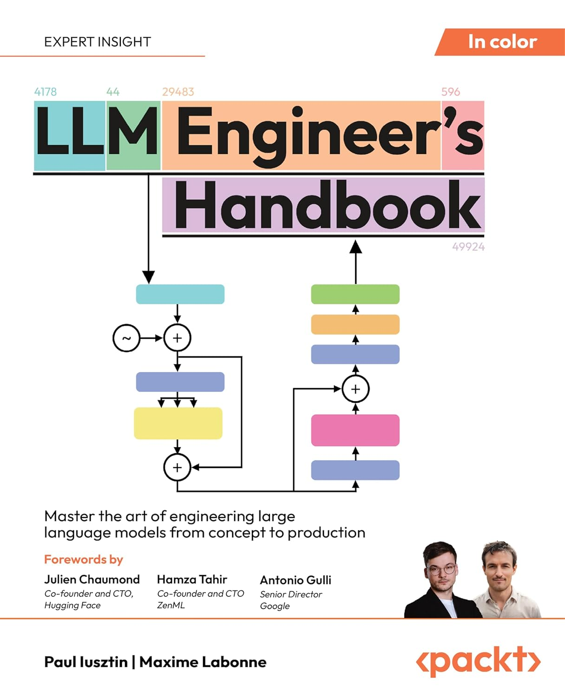

# LLM Engineer Handbook - Personal Notes



This repository is my personal learning journal for working through *LLM Engineer's Handbook: Master the art of engineering large language models from concept to production* by Paul Iusztin and Maxime Labonne.

It is a living document. I will continue updating the notes, notebooks, experiments, and project ideas here as I work through the book and turn the concepts into things I can understand, test, and reuse.

## Purpose

My goal is to use this repository as more than a place to summarize chapters. I want it to become a practical workspace where I can:

- Capture the major ideas from each chapter in my own words.
- Build small experiments that reinforce the concepts.
- Connect the material to real projects, work efforts, and hobbies.
- Track questions, patterns, and implementation details that I want to revisit.
- Create a reference I can return to when building production-oriented LLM systems.

## Current Focus

I am currently working through Chapter 1: **Understand the LLM Twin Concept and Architecture**.

The first notebook is here:

- [Chapter 1 - Understanding the LLM Twin Concept and Architecture](1-Understanding-the-LLM-Twin-Concept-And-Architecture.ipynb)

This chapter is focused on understanding the overall LLM Twin idea, the architecture behind it, and how the pieces of an end-to-end LLM system fit together.

## Chapter Notes

Each chapter will have its own notes, experiments, or notebook as I work through the book. These notes may include summaries, diagrams, code examples, implementation questions, and reflections on how the ideas apply outside the book's examples.

The goal is not to copy the book. The goal is to learn the material deeply enough that I can explain it, adapt it, and use it in my own projects.

## Personal Application Areas

As I work through the concepts, I will look for ways to connect them to things I can relate to more directly, including:

- Work projects and operational workflows where LLMs could improve research, documentation, automation, or decision support.
- Personal productivity tools that help with note-taking, knowledge management, planning, and learning.
- Hobby projects where agents, retrieval, structured outputs, or evaluation workflows can make the ideas more concrete.
- Realistic production concerns such as data quality, observability, cost, security, testing, and deployment.

This section will grow over time as I find better examples and build more experiments.

## Project Structure

```text
.
├── assets/
│   └── llm-engineers-handbook-cover.jpg
├── README.md
└── 1-Understanding-the-LLM-Twin-Concept-And-Architecture.ipynb
```

For now, the repository starts small. As the project grows, I may add chapter-specific notebooks, supporting scripts, datasets, diagrams, or experiment notes.

## Progress

| Chapter | Topic | Status | Notes |
| --- | --- | --- | --- |
| 1 | Understand the LLM Twin Concept and Architecture | In progress | Initial notebook created |

Future chapters will be added as I continue to work through the book.

## How I'll Use This Repository

I will use this repository as a working space, not a finished publication. Some notes may be rough at first, then refined later as I understand the material better.

The process will usually look like this:

1. Read the chapter and capture the main ideas.
2. Create or update a notebook with notes, examples, and experiments.
3. Translate the chapter concepts into scenarios from my own work, projects, or hobbies.
4. Record follow-up questions and ideas for future experiments.
5. Revisit earlier notes as later chapters add more context.

Over time, this should become a practical map of how I am learning to engineer large language model systems from concept to production.
